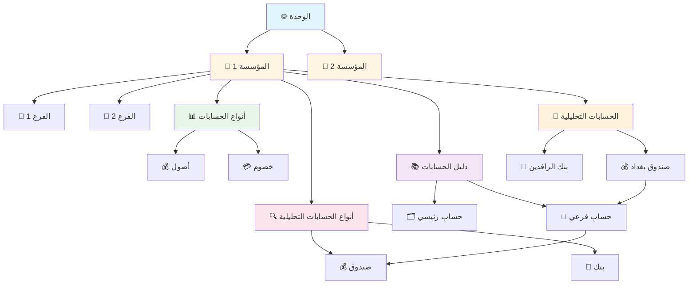

# 📘 دليل نظام الأباسي المحاسبي

> **نظام محاسبي ذكي ومرن - مصمم ليتكيف مع احتياجاتك، وليس العكس!** 🚀

**الإصدار**: 1.2  
**تاريخ التحديث**: 17 نوفمبر 2025  
**المطور**: Manus AI Agent  

---

## 🎯 فكرة النظام الأساسية

### 💡 لماذا نظام الأباسي مختلف؟

تخيل أنك تدير **عدة شركات** في نفس الوقت، كل شركة لها:
- 📊 دليل حسابات خاص بها
- 💰 سندات ومعاملات منفصلة
- 📈 تقارير مالية مستقلة
- 🏢 فروع متعددة

**المشكلة في الأنظمة التقليدية**: 
- ❌ نظام واحد = شركة واحدة فقط
- ❌ لإدارة 3 شركات، تحتاج 3 أنظمة منفصلة!
- ❌ صعوبة في المقارنة والتقارير الموحدة

**الحل في نظام الأباسي**:
- ✅ نظام واحد = عدد لا محدود من الشركات
- ✅ كل شركة معزولة تماماً عن الأخرى
- ✅ إدارة مركزية موحدة
- ✅ مرونة كاملة في التخصيص

---

## 🏗️ الهيكلية الكاملة للنظام

### 📐 المستويات الثلاثة

```
🌐 الوحدة (Unit)
   ↓
🏢 المؤسسة (Company)
   ↓
🏪 الفرع (Branch)
```

---

### 🌐 المستوى الأول: الوحدة (Unit)

**ما هي؟**  
الحاوية الرئيسية للنظام بأكمله - مثل "المظلة الكبيرة" التي تحتوي على كل شيء.

**الوظيفة:**
- 🎯 نقطة الإدارة المركزية
- 📊 التقارير الموحدة لجميع المؤسسات
- 🔐 إدارة المستخدمين والصلاحيات

**مثال عملي:**
```
🌐 وحدة: "مجموعة الأباسي القابضة"
```

**ملاحظة مهمة:** في معظم الحالات، ستحتاج وحدة واحدة فقط! 🎯

---

### 🏢 المستوى الثاني: المؤسسة (Company)

**ما هي؟**  
كيان محاسبي **مستقل تماماً** - كل مؤسسة = نظام محاسبي كامل منفصل!

**البيانات المعزولة لكل مؤسسة:**

| المكون | الوصف | مثال |
|--------|-------|------|
| 📚 **دليل الحسابات** | منفصل تماماً | مؤسسة A لها دليل مختلف عن مؤسسة B |
| 🏪 **الفروع** | خاصة بالمؤسسة | فروع مؤسسة A لا تظهر في مؤسسة B |
| 💰 **السندات** | معزولة | سندات كل مؤسسة منفصلة |
| 📝 **القيود** | مستقلة | قيود كل مؤسسة لوحدها |
| 📊 **التقارير** | خاصة | تقارير مالية منفصلة |

**مثال عملي:**
```
🏢 المؤسسة 1: "شركة الأباسي للتجارة العامة"
   - دليل حسابات تجاري
   - 5 فروع في بغداد
   
🏢 المؤسسة 2: "شركة الأباسي للخدمات العقارية"
   - دليل حسابات عقاري
   - 3 فروع في البصرة
   
🏢 المؤسسة 3: "شركة الأباسي للاستيراد والتصدير"
   - دليل حسابات استيراد/تصدير
   - فرع واحد في أربيل
```

**الفائدة:** كل مؤسسة تعمل بشكل مستقل، لكن يمكنك رؤية التقارير الموحدة! 🎯

---

### 🏪 المستوى الثالث: الفرع (Branch)

**ما هو؟**  
موقع جغرافي أو قسم داخل المؤسسة.

**الوظيفة:**
- 📍 تحديد موقع العمليات المحاسبية
- 📊 تقارير على مستوى الفروع
- 💰 تتبع الأداء المالي لكل فرع

**مثال عملي:**
```
🏢 شركة الأباسي للتجارة العامة
   ├── 🏪 فرع بغداد - الكرادة
   ├── 🏪 فرع بغداد - المنصور
   ├── 🏪 فرع البصرة
   └── 🏪 فرع الموصل
```

---

## 📚 دليل الحسابات الذكي

### 🎨 الفكرة الأساسية

دليل الحسابات في نظام الأباسي **مرن وذكي**، وليس صارماً وغبياً! 🧠

**الميزات الرئيسية:**
- ✅ ترقيم مرن (استخدم أي أرقام تريدها)
- ✅ هيكلية شجرية متعددة المستويات
- ✅ حسابات رئيسية (للترتيب) وحسابات فرعية (للترحيل)
- ✅ ربط بأنواع الحسابات (قابلة للتخصيص)
- ✅ ربط بالحسابات التحليلية

---

### 🔢 نظام الترقيم المرن

**القاعدة الذهبية:** استخدم أي أرقام تريدها! 🎯

**أمثلة:**
```
✅ يمكنك استخدام: 1, 2, 3, 4, 5...
✅ أو: 10, 20, 30, 40, 50...
✅ أو: 100, 200, 300, 400, 500...
✅ أو: 1000, 1100, 1200, 1300...
✅ أو حتى: 5, 17, 23, 101, 500...
```

**المهم:** الترتيب يعتمد على الرقم، والعلاقات تعتمد على `parent_id`! 🔗

---

### 🌳 الهيكلية الشجرية

#### 📊 نوعان من الحسابات:

| النوع | الرمز | الوظيفة | يمكن الترحيل عليه؟ | يرتبط بحساب تحليلي؟ |
|-------|------|---------|-------------------|---------------------|
| 🗂️ **حساب رئيسي** | `is_main = true` | للترتيب والتقارير فقط | ❌ لا | ❌ لا |
| 💼 **حساب فرعي** | `is_main = false` | حساب فعلي للترحيل | ✅ نعم | ✅ نعم (اختياري) |

---

### 🎯 مثال عملي كامل

```
📊 دليل حسابات شركة الأباسي للتجارة

1000 - 🗂️ الأصول (رئيسي)
  │
  ├── 1100 - 🗂️ الأصول المتداولة (رئيسي - أب: 1000)
  │   │
  │   ├── 1110 - 🗂️ النقدية (رئيسي - أب: 1100)
  │   │   │
  │   │   ├── 1111 - 💼 الصندوق الرئيسي (فرعي - نوع: صندوق)
  │   │   ├── 1112 - 💼 صندوق الفرع (فرعي - نوع: صندوق)
  │   │   │
  │   │   ├── 1120 - 🗂️ البنوك (رئيسي - أب: 1110)
  │   │   │   ├── 1121 - 💼 بنك الرافدين (فرعي - نوع: بنك)
  │   │   │   ├── 1122 - 💼 بنك الرشيد (فرعي - نوع: بنك)
  │   │   │   └── 1123 - 💼 بنك بغداد (فرعي - نوع: بنك)
  │   │   │
  │   │   └── 1130 - 🗂️ المحافظ الإلكترونية (رئيسي - أب: 1110)
  │   │       ├── 1131 - 💼 محفظة زين كاش (فرعي - نوع: محفظة)
  │   │       └── 1132 - 💼 محفظة آسيا (فرعي - نوع: محفظة)
  │   │
  │   └── 1200 - 🗂️ الذمم المدينة (رئيسي - أب: 1100)
  │       └── 1210 - 💼 العملاء (فرعي - نوع: عميل)
  │
  └── 1300 - 🗂️ الأصول الثابتة (رئيسي - أب: 1000)
      ├── 1310 - 💼 الأراضي (فرعي)
      └── 1320 - 💼 المباني (فرعي)

2000 - 🗂️ الخصوم (رئيسي)
  └── 2100 - 🗂️ الخصوم المتداولة (رئيسي - أب: 2000)
      └── 2110 - 🗂️ الذمم الدائنة (رئيسي - أب: 2100)
          └── 2111 - 💼 الموردون (فرعي - نوع: مورد)
```

**ملاحظات مهمة:**
- 🗂️ **الحسابات الرئيسية**: للترتيب فقط، لا يمكن الترحيل عليها
- 💼 **الحسابات الفرعية**: الحسابات الفعلية، يمكن الترحيل عليها
- 🔗 **العلاقات**: كل حساب يمكن أن يكون له حساب أب (رئيسي أو فرعي)

---

## 🔍 أنواع الحسابات (Account Types)

### 💡 الفكرة

كل مؤسسة تستطيع تعريف **أنواع الحسابات** الخاصة بها!

**أمثلة على أنواع الحسابات:**
- 💰 أصول (Assets)
- 💳 خصوم (Liabilities)
- 👥 حقوق الملكية (Equity)
- 📈 إيرادات (Revenue)
- 📉 مصروفات (Expenses)

**الميزة:** كل نوع له **طبيعة** (مدين أو دائن) يتم تحديدها عند الإنشاء! 🎯

### 📋 جدول account_types

| الحقل | الوصف | مثال |
|-------|-------|------|
| `company_id` | المؤسسة المالكة | 1 |
| `code` | رمز النوع | AST |
| `name` | اسم النوع | أصول |
| `nature` | طبيعة الحساب | debit (مدين) |
| `is_active` | نشط؟ | true |

**مثال:**
```
🏢 شركة الأباسي للتجارة
   ├── 💰 AST - أصول (مدين)
   ├── 💳 LIA - خصوم (دائن)
   ├── 👥 EQU - حقوق الملكية (دائن)
   ├── 📈 REV - إيرادات (دائن)
   └── 📉 EXP - مصروفات (مدين)
```

---

## 🎯 الحسابات التحليلية

### 💡 ما هي الحسابات التحليلية؟

الحسابات التحليلية هي **أنواع فرعية محددة** للحسابات، تُستخدم لتصنيف الحسابات بشكل أكثر تفصيلاً.

**أمثلة:**
- 💰 **صندوق** (Cash Box)
- 🏦 **بنك** (Bank)
- 👤 **صراف** (Cashier)
- 💳 **محفظة** (Wallet)
- 🏭 **مورد** (Supplier)
- 👥 **عميل** (Customer)

---

### 🔄 كيف تعمل؟

#### 📊 المستوى الأول: أنواع الحسابات التحليلية

**جدول: `analytical_account_types`**

كل مؤسسة تُعرّف الأنواع التحليلية التي تحتاجها:

```
🏢 شركة الأباسي للتجارة
   ├── 💰 CASH - صندوق
   ├── 🏦 BANK - بنك
   ├── 👤 CASHIER - صراف
   ├── 💳 WALLET - محفظة
   ├── 🏭 SUPPLIER - مورد
   └── 👥 CUSTOMER - عميل
```

---

#### 💼 المستوى الثاني: ربط الحسابات الفرعية بالأنواع التحليلية

عند إضافة **حساب فرعي** في دليل الحسابات، يمكنك تحديد نوعه التحليلي:

**مثال:**
```
1111 - الصندوق الرئيسي (فرعي)
   └── النوع التحليلي: 💰 صندوق

1121 - بنك الرافدين (فرعي)
   └── النوع التحليلي: 🏦 بنك

2111 - الموردون (فرعي)
   └── النوع التحليلي: 🏭 مورد
```

---

#### 🎯 المستوى الثالث: الحسابات التحليلية الفعلية

**جدول: `analytical_accounts`**

هنا تُضاف الحسابات التحليلية **الفعلية** - مثل صناديق محددة، بنوك محددة، موردين محددين.

**مثال: إضافة صندوق جديد**

```
📋 واجهة: الحسابات التحليلية → الصناديق → إضافة صندوق جديد

1️⃣ اختر النوع: 💰 صندوق
2️⃣ اختر الحساب الفرعي: [قائمة تعرض فقط الحسابات من نوع "صندوق"]
   - 1111 - الصندوق الرئيسي ✅
   - 1112 - صندوق الفرع ✅
3️⃣ أدخل البيانات:
   - الرمز: CASH-BGD-01
   - الاسم: صندوق بغداد - الكرادة
   - الوصف: صندوق فرع الكرادة
```

**النتيجة:**
```
💰 صندوق بغداد - الكرادة
   ├── النوع: صندوق
   ├── مرتبط بالحساب: 1111 - الصندوق الرئيسي
   └── الرمز: CASH-BGD-01
```

---

### 🎨 مثال عملي كامل

```
📚 دليل الحسابات:
   1111 - الصندوق الرئيسي (فرعي - نوع: صندوق)
   1121 - بنك الرافدين (فرعي - نوع: بنك)
   2111 - الموردون (فرعي - نوع: مورد)

🎯 الحسابات التحليلية الفعلية:

💰 الصناديق:
   ├── صندوق بغداد - الكرادة → مرتبط بـ 1111
   ├── صندوق بغداد - المنصور → مرتبط بـ 1111
   └── صندوق البصرة → مرتبط بـ 1111

🏦 البنوك:
   ├── حساب بنك الرافدين - فرع الكرادة → مرتبط بـ 1121
   └── حساب بنك الرافدين - فرع المنصور → مرتبط بـ 1121

🏭 الموردون:
   ├── شركة ABC للتجارة → مرتبط بـ 2111
   ├── مؤسسة XYZ للاستيراد → مرتبط بـ 2111
   └── شركة الأمل للمواد الغذائية → مرتبط بـ 2111
```

---

## 🔄 سير العمل الكامل

### 📋 الخطوة 1: إنشاء المؤسسة

```
🏢 إنشاء مؤسسة جديدة: "شركة الأباسي للتجارة"
   ├── الرمز: COM001
   ├── الاسم: شركة الأباسي للتجارة العامة
   └── المدير: أحمد العباسي
```

---

### 📊 الخطوة 2: تعريف أنواع الحسابات

```
🎯 إضافة أنواع الحسابات:
   ├── AST - أصول (مدين)
   ├── LIA - خصوم (دائن)
   ├── REV - إيرادات (دائن)
   └── EXP - مصروفات (مدين)
```

---

### 🔍 الخطوة 3: تعريف أنواع الحسابات التحليلية

```
🎯 إضافة أنواع الحسابات التحليلية:
   ├── CASH - صندوق
   ├── BANK - بنك
   ├── SUPPLIER - مورد
   └── CUSTOMER - عميل
```

---

### 📚 الخطوة 4: بناء دليل الحسابات

```
📊 إضافة الحسابات:

1️⃣ حساب رئيسي:
   - الرقم: 1000
   - الاسم: الأصول
   - النوع: أصول
   - رئيسي؟ ✅ نعم

2️⃣ حساب رئيسي فرعي:
   - الرقم: 1100
   - الاسم: الأصول المتداولة
   - النوع: أصول
   - الحساب الأب: 1000 - الأصول
   - رئيسي؟ ✅ نعم

3️⃣ حساب فرعي (للترحيل):
   - الرقم: 1111
   - الاسم: الصندوق الرئيسي
   - النوع: أصول
   - الحساب الأب: 1100 - الأصول المتداولة
   - رئيسي؟ ❌ لا (فرعي)
   - النوع التحليلي: 💰 صندوق ✅
```

---

### 🎯 الخطوة 5: إضافة الحسابات التحليلية الفعلية

```
💰 إضافة صندوق جديد:
   - النوع: صندوق
   - الحساب الفرعي: 1111 - الصندوق الرئيسي
   - الرمز: CASH-BGD-01
   - الاسم: صندوق بغداد - الكرادة
```

---

### 💰 الخطوة 6: إنشاء سند صرف

```
📝 سند صرف جديد:
   - النوع: صرف
   - طريقة الدفع: نقدي
   - الحساب: 1111 - الصندوق الرئيسي
   - الحساب التحليلي: صندوق بغداد - الكرادة
   - المبلغ: 500,000 دينار
   - البيان: صرف رواتب الموظفين
```

---

## 🎨 المخطط الكامل للنظام



---

## ✨ الميزات الرئيسية

### 🎯 المرونة الكاملة

| الميزة | الوصف |
|--------|-------|
| 🔢 **ترقيم مرن** | استخدم أي أرقام تريدها، غيّرها متى شئت |
| 🌳 **هيكلية شجرية** | عدد لا محدود من المستويات |
| 🎨 **تخصيص كامل** | كل مؤسسة لها أنواع حسابات خاصة |
| 🔄 **سهولة التعديل** | غيّر الربط، انقل الحسابات، عدّل الأرقام |
| 🚀 **قابل للتوسع** | أضف أنواع جديدة في أي وقت |

---

## 📊 قاعدة البيانات

### 🗄️ الجداول الرئيسية

| الجدول | الوصف | الأيقونة |
|--------|-------|----------|
| `units` | الوحدات | 🌐 |
| `companies` | المؤسسات | 🏢 |
| `branches` | الفروع | 🏪 |
| `account_types` | أنواع الحسابات | 📊 |
| `analytical_account_types` | أنواع الحسابات التحليلية | 🔍 |
| `accounts` | دليل الحسابات | 📚 |
| `analytical_accounts` | الحسابات التحليلية الفعلية | 🎯 |
| `vouchers` | السندات | 💰 |
| `journal_entries` | القيود اليومية | 📝 |

---

## 🎓 نصائح وأفضل الممارسات

### ✅ افعل

- ✅ استخدم أرقاماً متسلسلة ومنطقية (100، 200، 300...)
- ✅ اترك فراغات بين الأرقام للإضافات المستقبلية
- ✅ استخدم أسماء واضحة ومفهومة
- ✅ حدد النوع التحليلي للحسابات الفرعية المهمة

### ❌ لا تفعل

- ❌ لا تستخدم أرقاماً عشوائية غير منطقية
- ❌ لا تجعل كل الحسابات رئيسية
- ❌ لا تربط الحسابات الرئيسية بأنواع تحليلية
- ❌ لا تنسَ تحديد الحساب الأب للحسابات الفرعية

---

## 🔄 سجل التحديثات

| الإصدار | التاريخ | التحديثات |
|---------|---------|-----------|
| **1.2** | 17-11-2025 | ✨ إضافة نظام دليل الحسابات الذكي<br>✨ إضافة نظام الحسابات التحليلية<br>✨ إضافة أنواع الحسابات القابلة للتخصيص<br>🎨 تحسين الدليل بطريقة ملونة وممتعة |
| **1.1** | 17-11-2025 | ✨ إضافة نظام المؤسسات والوحدات<br>✨ إضافة صفحة الدليل داخل النظام |
| **1.0** | 17-11-2025 | 🎉 إطلاق النظام الأولي<br>✨ نظام السندات<br>📊 الهيكلية الأساسية |

---

## 🎯 الخلاصة

نظام الأباسي المحاسبي هو نظام **ذكي ومرن**، مصمم ليتكيف مع احتياجاتك:

- 🌐 **وحدة واحدة** ← عدد لا محدود من المؤسسات
- 🏢 **كل مؤسسة** ← نظام محاسبي مستقل تماماً
- 📚 **دليل حسابات** ← مرن وقابل للتخصيص
- 🎯 **حسابات تحليلية** ← لتتبع دقيق ومفصل
- 🚀 **قابل للتوسع** ← أضف ما تشاء متى تشاء

---

**🎉 استمتع باستخدام نظام الأباسي المحاسبي!**

---

*تم التطوير بواسطة Manus AI Agent 🤖*  
*لأي استفسارات أو اقتراحات، يرجى زيارة صفحة الدليل في النظام* 📘
