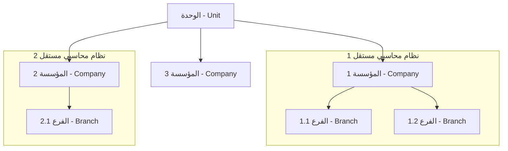
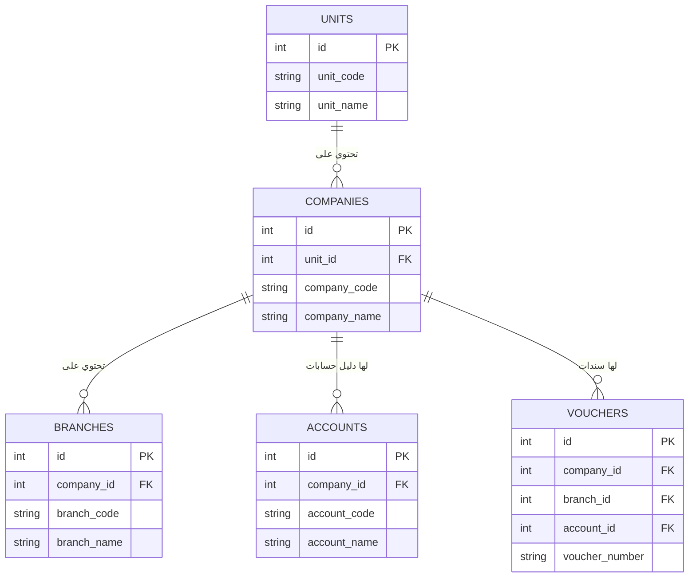

# دليل نظام الأباسي المحاسبي

**الإصدار**: 1.0
**تاريخ التحديث**: 17 نوفمبر 2025
**المؤلف**: Manus AI Agent

---

## 1. فكرة النظام الأساسية

تم تصميم نظام الأباسي المحاسبي ليكون نظاماً مرناً وقابلاً للتوسع، يهدف إلى توفير حلول محاسبية متكاملة للشركات والمؤسسات بمختلف أحجامها. الفكرة الجوهرية للنظام تقوم على مبدأ **العزل والفصل** بين الكيانات المحاسبية المختلفة، مع الحفاظ على إدارة مركزية موحدة.

النظام يتيح إدارة عدة مؤسسات (شركات) تعمل بشكل مستقل تماماً، كل منها لها نظامها المحاسبي الخاص، وذلك ضمن "وحدة" رئيسية واحدة. هذا يسمح بتطبيق سياسات محاسبية مختلفة، وإدارة أدلة حسابات منفصلة، وإصدار تقارير مالية خاصة بكل مؤسسة على حدة.

---

## 2. الهيكلية الصحيحة للنظام

يعتمد النظام على هيكلية هرمية ثلاثية المستويات، وهي:

**الوحدة (Unit) ← المؤسسة (Company) ← الفرع (Branch)**

### 2.1. الوحدة (Unit)

- **المفهوم**: هي الحاوية الرئيسية للنظام بأكمله. يمكن اعتبارها "النظام المركزي" أو "الوحدة الإدارية العليا".
- **الوظيفة**: توفر نقطة إدارة مركزية لجميع المؤسسات التابعة لها. في معظم الحالات، سيكون هناك وحدة واحدة فقط في النظام بأكمله.
- **مثال**: "وحدة المحاسبة المركزية لشركة الأباسي القابضة".

### 2.2. المؤسسة (Company)

- **المفهوم**: هي كيان محاسبي مستقل تماماً يعمل داخل الوحدة. كل مؤسسة لها بياناتها الخاصة التي لا تتداخل مع بيانات المؤسسات الأخرى.
- **الوظيفة**: تمثل شركة أو منظمة منفصلة. كل العمليات المحاسبية (الحسابات، القيود، السندات، الفروع) ترتبط مباشرة بالمؤسسة.
- **البيانات المعزولة لكل مؤسسة**:
    - دليل حسابات خاص.
    - فروع خاصة بها.
    - سندات وقيود يومية خاصة بها.
    - تقارير مالية مستقلة.
- **مثال**: "شركة الأباسي للتجارة العامة"، "شركة الأباسي للخدمات العقارية".

### 2.3. الفرع (Branch)

- **المفهوم**: هو المستوى الأدنى في الهيكلية، ويمثل موقعاً جغرافياً أو قسماً داخل المؤسسة.
- **الوظيفة**: يرتبط الفرع مباشرة بالمؤسسة. يستخدم لتحديد موقع العمليات المحاسبية وتسهيل إصدار التقارير على مستوى الفروع.
- **مثال**: "فرع بغداد"، "فرع البصرة" (كلاهما يتبعان لنفس المؤسسة).

---

## 3. المكونات الرئيسية وقاعدة البيانات

### 3.1. الجداول الرئيسية والعلاقات

| الجدول | الوصف | الحقل الرئيسي للربط | يرتبط بـ |
| :--- | :--- | :--- | :--- |
| **units** | الوحدات (النظام المركزي) | `id` | - |
| **companies** | المؤسسات (أنظمة محاسبية مستقلة) | `id`, `unit_id` | `units` |
| **branches** | الفروع (مواقع جغرافية/أقسام) | `id`, `company_id` | `companies` |
| **accounts** | دليل الحسابات | `id`, `company_id` | `companies` |
| **vouchers** | سندات الصرف والقبض | `id`, `company_id` | `companies`, `branches`, `accounts` |
| **journal_entries** | القيود اليومية | `id`, `company_id` | `companies` |

### 3.2. مخطط العلاقات (ERD)

---

## 4. سجل التحديثات

| الإصدار | التاريخ | التغييرات الرئيسية |
| :--- | :--- | :--- |
| 1.0 | 17-11-2025 | - إنشاء الدليل الأولي.
| | | - توضيح فكرة النظام والهيكلية الصحيحة (الوحدة ← المؤسسة ← الفرع). |
| 
| | | - إضافة مخططات توضيحية للعلاقات. |

---

## 5. كيفية المساهمة والتحديث

هذا الدليل هو مستند حي يتم تحديثه باستمرار مع كل إضافة أو تعديل على النظام. عند إضافة ميزة جديدة، يرجى اتباع الخطوات التالية:

1.  **تحديث الهيكلية**: إذا كانت الميزة تؤثر على الهيكلية، قم بتحديث القسم (2) والمخططات التوضيحية.
2.  **تحديث المكونات**: أضف الجداول أو الحقول الجديدة إلى القسم (3).
3.  **تسجيل التحديث**: أضف سطراً جديداً في سجل التحديثات (القسم 4) يوضح التغيير الذي قمت به.
